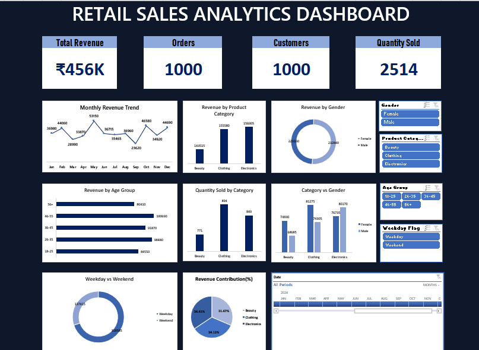

# Excel-Dashboard
# Retail Sales Analytics Dashboard (Excel)

##  Overview
An interactive Retail Sales Dashboard built in **Microsoft Excel** using Pivot Tables, Pivot Charts, KPI Cards, Slicers, and Timeline. This project transforms raw retail sales data into meaningful business insights through dynamic visualizations.

---

##  Features
-  Interactive Dashboard
-  KPI Cards
-  Pivot Tables & Pivot Charts
-  Slicers and Timeline
-  Data Cleaning & Helper Columns

---

## 📂 Dataset
**Source:** Kaggle – Retail Sales Dataset

https://www.kaggle.com/datasets/mohammadtalib786/retail-sales-dataset

---

## 🖼 Dashboard Preview

---

##  Tools Used
- Microsoft Excel
- Pivot Tables
- Pivot Charts
- Slicers & Timeline
- Data Cleaning

---

## 📄 Project Documentation

A detailed step-by-step project report is available here:

📥 [Retail Sales Dashboard Report](Retail_Sales_Dashboard_Report.pdf)

---

## 👨‍💻 Author
**Krishnendhu Sudheer**

Master's in Actuarial Science
